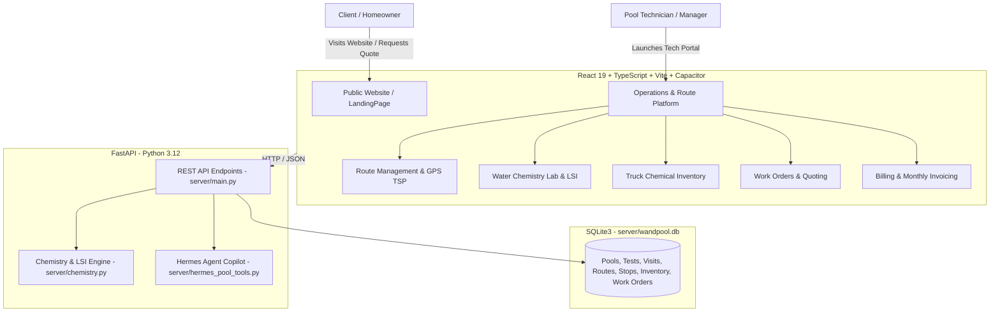

# 🏊 OBW Pools - Comprehensive Master Engineering Manual

> **Universal Project Documentation**: This document is designed for any developer, AI agent (Claude Code, Cursor, Windsurf, Antigravity, Codex, Hermes Agent, Aider, Copilot), or technical operator working in any harness/environment.

---

## 📑 Table of Contents
1. [Project Overview & Business Domain](#1-project-overview--business-domain)
2. [Tech Stack & System Architecture](#2-tech-stack--system-architecture)
3. [Repository Directory Structure](#3-repository-directory-structure)
4. [Complete Component & File Map](#4-complete-component--file-map)
5. [Database Schema & Relational Models (SQLite)](#5-database-schema--relational-models-sqlite)
6. [Pool Chemistry Engine & Mathematical Models](#6-pool-chemistry-engine--mathematical-models)
7. [Field Operations & TSP Route Optimization](#7-field-operations--tsp-route-optimization)
8. [AI Integration (Nous Research Hermes Agent)](#8-ai-integration-nous-research-hermes-agent)
9. [Local Development, Build & Testing Commands](#9-local-development-build--testing-commands)
10. [Cloudflare Pages & Production Deployment Guide](#10-cloudflare-pages--production-deployment-guide)

---

## 1. Project Overview & Business Domain

**OBW Pools** (*"Cleaning • Maintenance • Repairs - Cleaner Pools. Stronger Performance"*) is a dual-purpose web and mobile platform:
1. **Public Luxury Website & Lead Generation Hub**: A modern, high-converting corporate website built for homeowners and HOA managers in Dallas-Fort Worth (DFW), Texas. Includes service details, interactive before/after sliders, real-time cost estimation, direct contact via phone `(754) 235-1214` and WhatsApp.
2. **Operations & Field Service Management Platform**: An enterprise-grade tool for pool technicians and route managers (inspired by industry leaders like **Skimmer**, **Pool Brain**, and **PoolTrackr**). Features include GPS route optimization (TSP Nearest-Neighbor), digital before/after photo proofing, automatic truck chemical inventory tracking, work orders and repair quoting in `$ USD`, Texas weather alerts, recurring monthly billing, and a precision **LSI (Langelier Saturation Index)** chemistry lab.

---

## 2. Tech Stack & System Architecture



| Layer | Technologies Used | Key Responsibilities |
| :--- | :--- | :--- |
| **Frontend** | React 19, TypeScript strictly typed, Vite 6, Lucide Icons, Canvas-Confetti | Corporate landing page, operational dashboard, interactive calculators, route management, responsive mobile layout. |
| **Mobile Native** | Capacitor 8 (`@capacitor/core`, `@capacitor/camera`, `@capacitor/geolocation`) | PWA & Android native APK builds, mobile camera capture for pool photos, GPS geolocation. |
| **Backend** | Python 3.12, FastAPI, Uvicorn, Pydantic v2 | High-performance REST API, route optimization calculation, chemical dosing engine. |
| **Database** | SQLite3 (`server/wandpool.db`) with optimized relational schema | Persistent storage of pool specs, water test history, service visits, routes, stops, technicians, and work orders. |
| **AI Copilot** | Nous Research Hermes Agent (`vendor/hermes-agent`) | Pool diagnostic tools (`pool_diagnose_water`, `pool_calculate_dosages`, `pool_troubleshoot_symptom`). |
| **Testing** | Pytest, TypeScript Compiler (`tsc -b`), Oxlint | Automated backend test suite (13 unit/integration tests) and static type validation. |

---

## 3. Repository Directory Structure

```
OBWPools/
├── AGENTS.md                  # Behavioral guidelines & chemistry reference ranges
├── PROJECT_MANUAL.md          # This comprehensive engineering master manual
├── README.md                  # General project readme and quickstart
├── package.json               # Root scripts delegating to client and server
├── docs/                      # Technical manuals and design specifications
│   ├── ARCHITECTURE.md        # Architectural flowcharts and sequences
│   ├── CHEMISTRY_ENGINE.md    # Detailed LSI and chemical dosing mathematics
│   ├── API_REFERENCE.md       # Complete REST API endpoint documentation
│   └── superpowers/           # Superpowers design specs and execution plans
├── server/                    # Python FastAPI backend & SQLite database
│   ├── main.py                # REST endpoints and routing
│   ├── chemistry.py           # Mathematical calculation engine (LSI, volumes, dosages)
│   ├── db.py                  # SQLite layer, DFW seed data, TSP optimization
│   ├── models.py              # Pydantic data schemas
│   ├── hermes_pool_tools.py   # AI tool calling integration
│   └── wandpool.db            # Local SQLite database pre-seeded with DFW properties
├── client/                    # React 19 + TypeScript + Vite frontend
│   ├── index.html             # Application entry HTML with PWA meta tags
│   ├── package.json           # Frontend dependencies
│   ├── vite.config.ts         # Vite build configuration
│   ├── capacitor.config.ts    # Android/iOS Capacitor configuration
│   ├── public/
│   │   ├── logo.png           # Official OBW Pools metallic shield emblem
│   │   └── manifest.json      # PWA application manifest
│   └── src/
│       ├── App.tsx            # Main controller managing viewMode ('landing' | 'app')
│       ├── main.tsx           # React DOM root entry
│       ├── index.css          # Design system tokens and global styling
│       ├── types/pool.ts      # TypeScript interfaces and domain types
│       ├── lib/               # Utilities, API client, inventory logic, weather
│       │   ├── api.ts         # REST API wrapper with automatic offline fallback
│       │   ├── chemistry.ts   # Client-side chemistry calculation helpers
│       │   ├── inventory.ts   # Truck stock tracking and deduction logic
│       │   └── weather.ts     # DFW weather forecast and freeze alert engine
│       └── components/        # UI modules
│           ├── LandingPage.tsx          # Public corporate luxury landing page
│           ├── BeforeAfterSlider.tsx    # Interactive before/after transformation slider
│           ├── PricingCalculator.tsx    # Plan pricing estimator & WhatsApp lead generator
│           ├── QuoteFormModal.tsx       # Instant quote request modal with confetti
│           ├── Navbar.tsx               # Top header with staff portal switcher
│           ├── BottomNav.tsx            # Mobile Android bottom navigation bar
│           ├── WelcomeScreen.tsx        # Internal platform welcome overview
│           ├── RouteManager.tsx         # Route management, TSP optimization & Waze/Maps GPS
│           ├── PhotoProofManager.tsx    # Before, After & Equipment photo documentation
│           ├── WaterLab.tsx             # Water chemistry test logger and LSI gauge
│           ├── DosageCalculator.tsx     # Chemical dosing converter (oz, lbs, gal, g, ml)
│           ├── VolumeCalculator.tsx     # Pool volume calculator by geometry
│           ├── EquipmentManager.tsx     # Filter pressure (ΔPSI) & pump turnover tracker
│           ├── TruckInventory.tsx       # Technician truck inventory with auto-deduction
│           ├── WorkOrderManager.tsx     # Equipment repair tickets & USD quoting
│           ├── BillingManager.tsx       # Monthly invoicing & recurring plans
│           ├── TeamManager.tsx          # Technician staff assignment and routes
│           ├── CustomerManager.tsx      # Customer roster and pool configuration
│           ├── ServiceChecklist.tsx     # Step-by-step physical cleaning checklist
│           ├── HermesCopilot.tsx        # AI Pool Assistant conversational interface
│           ├── NewPoolModal.tsx         # Modal to register new pools and clients
│           ├── EditPoolModal.tsx        # Modal to modify pool parameters and addresses
│           ├── PoolHistoryModal.tsx     # Complete service visit history modal
│           └── WeatherAlertsBanner.tsx  # DFW weather warnings banner
├── skills/                    # Domain knowledge playbooks
│   ├── pool-chemistry-diagnosis/
│   ├── chemical-dosing-calculator/
│   ├── equipment-troubleshooting/
│   └── seasonal-care/
└── tests/                     # Automated test suite (Pytest)
    ├── test_api.py            # API endpoint integration tests
    └── test_chemistry.py      # Mathematical verification of LSI, dosing, and volumes
```

---

## 4. Complete Component & File Map

### A. Public Website (`viewMode === 'landing'`)
1. **`LandingPage.tsx`**: High-converting corporate homepage in English. Contains:
   - **Utility Bar**: Serving DFW, Google 4.9★ rating, direct call `(754) 235-1214`, and discreet `🔒 Tech Portal` button.
   - **Hero Section**: Value proposition with embedded quick inspection request form and background photography.
   - **Trust Strip**: 4 credibility pillars (Photo Door Hangers, LSI Chemistry, Satisfaction Guarantee, 4.9 Stars).
   - **Services Grid**: 4 key services (*Full Weekly Cleaning*, *Precision Water Chemistry*, *Pump & Filter Maintenance*, *Green Pool Recovery*).
   - **How It Works**: 3-step workflow (Consultation ➔ Weekly Care ➔ Photos on Phone).
   - **Interactive Before & After**: Transformation cases with drag slider.
   - **Pricing & Plans**: Standard ($180/mo), Salt Chem Plus ($220/mo), Commercial ($450/mo), plus interactive volume estimator.
   - **Service Areas**: Badges for Frisco, Plano, McKinney, Southlake, Dallas, Prosper, Allen, etc.
   - **Corporate Footer**: Business contacts and internal team portal link.
2. **`BeforeAfterSlider.tsx`**: Clip-path image slider comparing unserviced murky pools with crystal-clear treated pools, including initial vs final LSI readings.
3. **`PricingCalculator.tsx`**: Real-time cost estimator allowing pool volume adjustments (8,000 to 45,000 gallons), sanitizer toggles (Salt vs Chlorine), and direct WhatsApp booking.
4. **`QuoteFormModal.tsx`**: Lead capture form modal validating name, phone, email, DFW city, and pool type with confetti celebration.

### B. Operations Platform (`viewMode === 'app'`)
1. **`App.tsx`**: Central orchestrator. Manages `viewMode` (`'landing'` or `'app'`), active tabs, selected pool, test logs, and modals.
2. **`Navbar.tsx`**: Navigation header with pool switcher dropdown, "Novo" pool button, navigation tabs, and a "🌐 Voltar ao Site" button to return to the public website.
3. **`RouteManager.tsx`**: Displays stops ordered by TSP algorithm, estimated arrival times, status transitions (`Pendente`, `A Caminho`, `Em Atendimento`, `Concluído`), 1-click GPS navigation (Waze & Google Maps), and photo modal triggers.
4. **`PhotoProofManager.tsx`**: 3-tier photo proofing (Before, After, Equipment/Manometer) and automated digital door hanger dispatch to WhatsApp and email.
5. **`WaterLab.tsx`**: Real-time chemical test inputs with instant LSI needle gauge ($-0.30$ to $+0.30$) and historical tracking.
6. **`DosageCalculator.tsx`**: Converts target chemical ppm adjustments into actionable physical quantities (lbs, oz, gallons, grams, milliliters).
7. **`TruckInventory.tsx`**: Monitors chemical quantities in the technician's vehicle bed (Muriatic Acid, Liquid Chlorine, Cal-Hypo, Salt bags, Soda Ash, Bicarbonate, Algaecide) and automatically debits quantities when visits are saved.
8. **`WorkOrderManager.tsx`**: Manages equipment repair tickets (Pumps, Filters, Heaters, Salt Cells, LEDs, Plumbing), parts and labor costing in `$ USD`, and WhatsApp proposal sharing.
9. **`WeatherAlertsBanner.tsx`**: Real-time Texas weather monitor displaying Freeze Warnings ($< 32^\circ\text{F}$) and Heatwave alerts ($> 98^\circ\text{F}$) with technical recommendations.
10. **`BillingManager.tsx`**: Manages monthly recurring maintenance subscriptions, chemical surcharge add-ons, and generates digital invoices.
11. **`HermesCopilot.tsx`**: AI pool maintenance copilot powered by Nous Research Hermes Agent tool calls.

---

## 5. Database Schema & Relational Models (SQLite)

Located in `server/wandpool.db`, initialized and managed in `server/db.py`:

```sql
-- Pools & Customer Master Table
CREATE TABLE IF NOT EXISTS pools (
    id TEXT PRIMARY KEY,
    name TEXT NOT NULL,
    customer_name TEXT NOT NULL,
    customer_phone TEXT,
    customer_email TEXT,
    address TEXT NOT NULL,
    latitude REAL DEFAULT 33.1507,
    longitude REAL DEFAULT -96.8236,
    gate_code TEXT,
    pool_type TEXT DEFAULT 'Residencial',
    surface_type TEXT DEFAULT 'Alvenaria / Azulejo',
    sanitizer_type TEXT DEFAULT 'Gerador de Sal (SWG)',
    volume_liters INTEGER DEFAULT 45000,
    volume_gallons INTEGER DEFAULT 11888,
    clean_filter_psi REAL DEFAULT 12.0,
    current_filter_psi REAL DEFAULT 14.0,
    filter_type TEXT DEFAULT 'Filtro de Cartucho',
    pump_hp REAL DEFAULT 1.5,
    daily_run_hours INTEGER DEFAULT 8,
    service_day TEXT DEFAULT 'Segunda-feira',
    service_frequency TEXT DEFAULT 'Semanal',
    target_params TEXT,
    created_at TEXT NOT NULL
);

-- Water Chemistry History
CREATE TABLE IF NOT EXISTS water_tests (
    id TEXT PRIMARY KEY,
    pool_id TEXT NOT NULL,
    timestamp TEXT NOT NULL,
    ph REAL NOT NULL,
    free_chlorine REAL NOT NULL,
    total_chlorine REAL NOT NULL,
    combined_chlorine REAL DEFAULT 0.0,
    total_alkalinity REAL NOT NULL,
    calcium_hardness REAL NOT NULL,
    cyanuric_acid REAL NOT NULL,
    salt_ppm REAL DEFAULT 0.0,
    temperature_c REAL DEFAULT 26.0,
    temperature_f REAL DEFAULT 78.8,
    lsi REAL NOT NULL,
    lsi_status TEXT NOT NULL,
    technician_notes TEXT,
    FOREIGN KEY (pool_id) REFERENCES pools (id)
);

-- Service Visits & Digital Door Hangers
CREATE TABLE IF NOT EXISTS service_visits (
    id TEXT PRIMARY KEY,
    pool_id TEXT NOT NULL,
    visit_date TEXT NOT NULL,
    technician_name TEXT NOT NULL,
    checklist_json TEXT,
    chemicals_json TEXT,
    photos_json TEXT,
    technician_notes TEXT,
    customer_summary TEXT,
    status TEXT DEFAULT 'Concluído',
    door_hanger_sent BOOLEAN DEFAULT 1,
    whatsapp_dispatched BOOLEAN DEFAULT 1,
    FOREIGN KEY (pool_id) REFERENCES pools (id)
);

-- Route Headers
CREATE TABLE IF NOT EXISTS routes (
    id TEXT PRIMARY KEY,
    technician_name TEXT NOT NULL,
    date TEXT NOT NULL,
    day_of_week TEXT NOT NULL,
    total_stops INTEGER DEFAULT 0,
    completed_stops INTEGER DEFAULT 0
);

-- Route Stops with Sequence and Coordinates
CREATE TABLE IF NOT EXISTS route_stops (
    stop_id TEXT PRIMARY KEY,
    route_id TEXT NOT NULL,
    pool_id TEXT NOT NULL,
    order_index INTEGER NOT NULL,
    scheduled_time TEXT NOT NULL,
    duration_mins INTEGER DEFAULT 45,
    status TEXT DEFAULT 'Pendente',
    photos_json TEXT,
    completed_at TEXT,
    FOREIGN KEY (route_id) REFERENCES routes (id),
    FOREIGN KEY (pool_id) REFERENCES pools (id)
);

-- Technicians Staff
CREATE TABLE IF NOT EXISTS technicians (
    id TEXT PRIMARY KEY,
    name TEXT NOT NULL,
    phone TEXT,
    email TEXT,
    truck_model TEXT,
    active_route_id TEXT,
    assigned_color TEXT,
    status TEXT DEFAULT 'Em Rota'
);
```

---

## 6. Pool Chemistry Engine & Mathematical Models

Implemented in `server/chemistry.py` and `client/src/lib/chemistry.ts`.

### 6.1 Standard Reference Ranges
| Parameter | Standard Range (Chlorine) | Saltwater Range (SWG) | Unit |
| :--- | :--- | :--- | :--- |
| **pH** | 7.4 - 7.6 | 7.4 - 7.6 | pH units |
| **Free Available Chlorine (FC)** | 2.0 - 4.0 | 3.0 - 5.0 | ppm |
| **Combined Chlorine (CC)** | < 0.2 (Max 0.5) | < 0.2 | ppm |
| **Total Alkalinity (TA)** | 80 - 120 | 70 - 100 | ppm |
| **Calcium Hardness (CH)** | 200 - 400 | 200 - 400 | ppm |
| **Cyanuric Acid (CYA)** | 30 - 50 | 60 - 80 | ppm |
| **Salt (NaCl)** | N/A | 2700 - 3400 | ppm |
| **LSI (Saturation Index)** | -0.30 to +0.30 | -0.30 to +0.30 | index |

### 6.2 LSI Saturation Formula (Langelier Index)
$$LSI = \text{pH} + TF + CF + AF - TDS$$
Where:
- $TF = \frac{\log_{10}(T_F) - 1}{10}$ (Temperature Factor)
- $CF = \log_{10}(CH) - 0.4$ (Calcium Hardness Factor)
- $AF = \log_{10}(TA - (CYA \times 0.33)) - 0.4$ (Carbonate Alkalinity adjusted for Cyanurate)
- $TDS \approx 12.1$ (Total Dissolved Solids constant for standard water; $12.2$ to $12.4$ for high-salt SWG pools).

**Status Classification**:
- $LSI < -0.30$: **Corrosive / Aggressive** (dissolves plaster grout, etches marble, corrodes heaters).
- $-0.30 \le LSI \le +0.30$: **Balanced / Ideal Equilibrium** (safe for swimmers, plaster, and equipment).
- $LSI > +0.30$: **Scale-Forming / Turbid** (calcium carbonate precipitates, causes cloudy water and scales salt cells).

### 6.3 Dosage Calculation Engine
- **pH Down**: Muriatic Acid $31.45\%$ ($5.0\text{ fl oz}$ per $10,000\text{ gal}$ per $0.1\text{ pH}$ drop).
- **pH Up**: Soda Ash / Sodium Carbonate ($3.0\text{ oz}$ per $10,000\text{ gal}$ per $0.1\text{ pH}$ rise).
- **Alkalinity Up**: Sodium Bicarbonate ($1.5\text{ lbs}$ per $10,000\text{ gal}$ per $+10\text{ ppm}$ TA).
- **Chlorine Up**: Liquid Chlorine $12.5\%$ ($10.7\text{ fl oz}$ per $10,000\text{ gal}$ per $+1.0\text{ ppm}$ FC) or Dichlor $56\%$ ($2.4\text{ oz}$ per $10,000\text{ gal}$).
- **Calcium Up**: Calcium Chloride $100\%$ ($1.25\text{ lbs}$ per $10,000\text{ gal}$ per $+10\text{ ppm}$ CH).
- **Salt (SWG)**: Salt ($8.3\text{ lbs}$ per $10,000\text{ gal}$ per $+100\text{ ppm}$ salt).

---

## 7. Field Operations & TSP Route Optimization

Implemented in `server/db.py` (`optimize_route_path`) and `server/main.py` (`/api/routes/optimize`):

1. **Algorithm**: Nearest-Neighbor Traveling Salesperson Problem (TSP) using the **Haversine Great-Circle Formula**:
   $$a = \sin^2\left(\frac{\Delta\text{lat}}{2}\right) + \cos(\text{lat}_1)\cos(\text{lat}_2)\sin^2\left(\frac{\Delta\text{lng}}{2}\right)$$
   $$d = 2R \cdot \text{atan2}\left(\sqrt{a}, \sqrt{1-a}\right) \quad (R = 6371.0\text{ km})$$
2. **Execution**: Starts from the company headquarters coordinates, iteratively picks the unvisited pool stop with the minimum geodesic distance, reassigns sequence `order_index = 1, 2, 3... N`, and recalculates estimated scheduled arrival times based on an estimated 55-minute service window per pool.
3. **One-Click GPS Links**:
   - **Google Maps**: `https://www.google.com/maps/dir/?api=1&destination={lat},{lng}`
   - **Waze**: `https://waze.com/ul?ll={lat},{lng}&navigate=yes`

---

## 8. AI Integration (Nous Research Hermes Agent)

The platform integrates with Nous Research's Hermes Agent via tool definitions in `server/hermes_pool_tools.py`:
- `pool_diagnose_water`: Ingests test parameters, returns LSI status, health risk assessment, and precise chemical recommendations.
- `pool_calculate_dosages`: Calculates exact chemical additions for volume and targets.
- `pool_troubleshoot_symptom`: Provides step-by-step resolution guides for symptoms like `agua_verde` (green algae), `agua_turva` (turbid water), `mancha_ferro` (iron staining), `algas_mostarda` (mustard algae), and `espuma` (surface foam).

---

## 9. Local Development, Build & Testing Commands

### Prerequisites
- **Node.js**: v18.0.0+ and **npm**
- **Python**: v3.11+ with `fastapi`, `uvicorn`, `pytest`

### Running the Frontend (Vite)
From root (`c:\ai-project\OBWPools`):
```powershell
npm run dev
```
👉 Access in browser: **`http://localhost:5173`** (or `http://localhost:5174` if busy)

### Running the Backend API (FastAPI)
From root in a separate terminal:
```powershell
npm run server
# Equivalent to: python -m uvicorn server.main:app --reload --port 8000
```
👉 Interactive Swagger Docs: **`http://localhost:8000/docs`**

### Running the Test Suite
```powershell
# Run the 13 automated backend tests
python -m pytest tests -v
```

### Compiling Production Bundle
```powershell
npm run build
# Compiles TypeScript and outputs to client/dist with 0 errors
```

---

## 10. Cloudflare Pages & Production Deployment Guide

### Domain & Contact Information
- **Official Domain**: `obwpools.us` / `www.obwpools.us`
- **Phone Number**: `(754) 235-1214`
- **WhatsApp Link**: `https://wa.me/17542351214`
- **Support Email**: `service@obwpools.com`

### Deploying to Cloudflare Pages via Git (Automated CI/CD)
1. In the **Cloudflare Dashboard** ➔ **Workers & Pages** ➔ **Create application** ➔ **Pages** ➔ **Connect to Git**.
2. Select repository `OBWPools`.
3. Set Build Settings:
   - **Framework preset**: `Vite`
   - **Root directory**: `client`
   - **Build command**: `npm run build`
   - **Build output directory**: `dist`
4. Set Environment Variable: `NODE_VERSION` = `20`.
5. Under **Custom domains**, add `obwpools.us` and `www.obwpools.us`. Cloudflare will automatically provision SSL certificates and global CDN caching.
