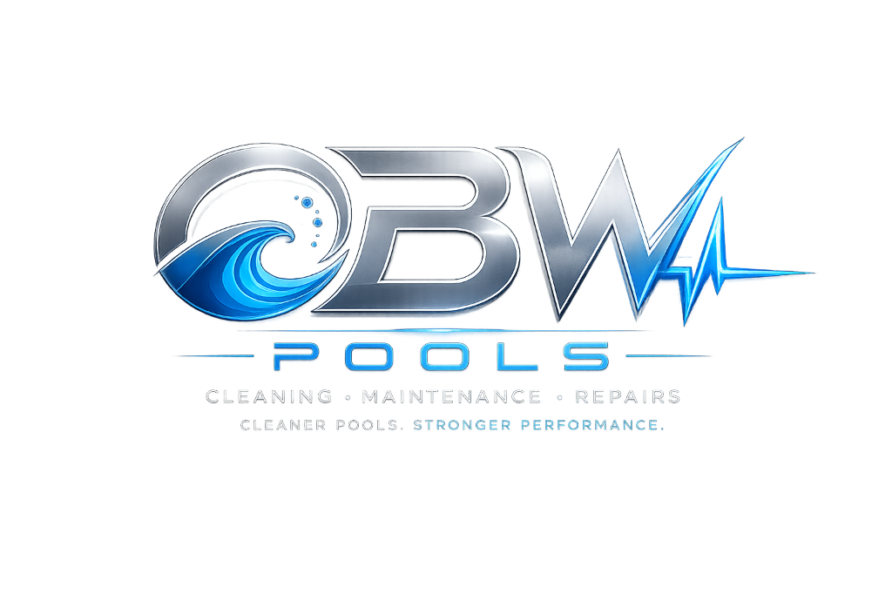

# 🏊 OBW Pools - Intelligent Pool Maintenance & Field Service Platform

<div align="center">
  
  <p><strong>CLEANING • MAINTENANCE • REPAIRS</strong></p>
  <p><em>Cleaner Pools. Stronger Performance.</em></p>

  [](https://fastapi.tiangolo.com)
  [](https://react.dev)
  [](https://www.typescriptlang.org)
  [](https://vitejs.dev)
  [](https://python.org)
  [](tests)
</div>

---

## 📖 Visão Geral do Projeto

O **OBW Pools** é uma plataforma empresarial completa desenvolvida para técnicos de serviço em campo, proprietários de empresas de manutenção de piscinas e clientes residenciais/comerciais. 

Inspirado nos líderes globais de software para piscinas (**Skimmer**, **Pool Brain** e **PoolTrackr**), o OBW Pools reúne otimização de rotas com inteligência artificial, cálculo de equilíbrio químico via **Índice de Saturação de Langelier ($LSI$)**, comprovação fotográfica com disparo automático via WhatsApp, controle de estoque da caçamba do caminhão, orçamentos de reparos e faturamento mensal automatizado.

---

## ✨ Principais Funcionalidades

### 1. 🗺️ Administração e Otimização Inteligente de Rotas (TSP + Haversine)
- **Algoritmo de Menor Caminho (Nearest-Neighbor TSP)**: Reordena as paradas diárias com base na distância geográfica real (*Haversine*), minimizando quilometragem, tempo de trânsito e custos de combustível.
- **Navegação GPS em 1-Clique**: Integração nativa com links diretos para **Google Maps** e **Waze**.
- **Gestão de Múltiplos Técnicos**: Suporte a equipes com rotas dedicadas por técnico (*Marcus Sterling, Elena Vance, Carlos Rodriguez*) e bairros de alto padrão em Dallas-Fort Worth (Frisco, Plano, McKinney, Southlake, Dallas).
- **Ciclo de Atendimento**: Fluxo com status em tempo real: `Pendente` ➔ `A Caminho` ➔ `Em Atendimento` ➔ `Concluído`.

### 2. 📸 Comprovação Fotográfica & Envio Digital (Digital Door Hanger)
- **Captura Fotográfica Tripla**:
  - 📷 **Antes**: Estado inicial da água e do fundo na chegada do técnico.
  - 📷 **Depois**: Água tratada, límpida e fundo aspirado.
  - 📷 **Equipamentos**: Registro da casa de máquinas e pressão no manômetro.
- **Disparo Instantâneo para WhatsApp e E-mail**: Geração automática de resumo completo com fotos anexadas, químicos adicionados e aviso de liberação para banho.

### 3. 🧪 Laboratório Químico de Precisão & Saturação LSI/CSI
- **Cálculo da Equação de Langelier ($LSI$)**:
  $$LSI = \text{pH} + TF + CF + AF - 12.1$$
  - Classificação visual instantânea: **Corrosiva/Agressiva** ($LSI < -0.30$), **Equilibrada** ($-0.30 \le LSI \le +0.30$) ou **Incrustante/Turva** ($LSI > +0.30$).
- **Calculadora de Dosagem Exata**: Recomendações em gramas, libras, mililitros ou galões para:
  - *Ácido Muriático* / *Ácido Seco*
  - *Barrilha Leve (Soda Ash)*
  - *Bicarbonato de Sódio (Sodium Bicarbonate)*
  - *Hipoclorito de Cálcio (Cal-Hypo)* / *Dicloro* / *Cloro Líquido*
  - *Cloreto de Cálcio* e *Sal para Geradores de Cloro Salino (SWG)*.
- **Calculadora de Volume**: Cálculo volumétrico em Galões e Litros para piscinas retangulares, redondas e ovais com variação de profundidade.

### 4. ⚙️ Saúde e Monitoramento de Equipamentos
- **Manômetro do Filtro**: Alerta visual automático quando a pressão ultrapassa $\Delta\text{PSI} \ge +6.0\text{ PSI}$ acima do baseline limpo, indicando a necessidade imediata de retrolavagem (*Backwash*).
- **Turnover & Recirculação**: Cálculo do tempo de recirculação completa da piscina em horas e consumo elétrico mensal em kWh.

### 5. 📦 Gestão de Estoque do Caminhão do Técnico
- Controle por técnico de químicos transportados no veículo (*Ácido, Cloro Líquido, Cal-Hypo, Sal, Soda Ash, Bicarbonato, Algicida*).
- **Baixa Automática**: Ao concluir uma visita técnica e salvar os químicos aplicados, a quantidade é deduzida diretamente do estoque da caminhonete.
- Alertas visuais de reposição rápida (*Restock Truck*).

### 6. 🛠️ Ordens de Serviço & Reparos (Work Orders)
- Abertura de chamados para manutenção preventiva e corretiva (*Bomba & Motor, Filtro & Areia, Aquecedor/Heater, Célula de Sal, Iluminação LED, Vazamentos*).
- Cotação detalhada de **Peças + Mão de Obra** em `$ USD`.
- Envio do orçamento em 1-clique diretamente para o WhatsApp do cliente.

### 7. 🌦️ Radar Climático Inteligente do Texas / DFW
- Monitoramento de temperatura (°F), umidade, vento e índice UV em tempo real.
- **Alertas Operacionais Automatizados**:
  - ❄️ **Freeze Warning (< 32°F)**: Alerta para manter bombas ligadas 24h para evitar congelamento de tubulações.
  - ☀️ **Heatwave (> 98°F)**: Recomendação de aumento de cloro livre e ácido cianúrico (CYA) contra fotólise UV.

### 8. 🧾 Faturamento & Invoicing Mensal
- Gestão de mensalidades por tipo de plano (*Weekly Standard, Salt Chem Plus, Commercial HOA*).
- Faturamento consolidado: Mensalidade base + Químicos extras aplicados + Reparos executados.
- Emissão de recibos digitais prontos para envio.

### 9. 🤖 Hermes Pool Copilot (Nous Research Hermes Agent)
- Assistente de inteligência artificial autônomo com chamada de ferramentas (`pool_diagnose_water`, `pool_calculate_dosages`, `pool_troubleshoot_symptom`) para suporte a diagnósticos avançados de algas, metais, manchas e pH lock.

---

## 🏗️ Arquitetura do Sistema

```
OBWPools/
├── AGENTS.md                  # Regras, referências químicas e playbooks de IA
├── package.json               # Scripts universais de execução na raiz
├── tests/                     # Testes automatizados (Pytest)
│   ├── test_api.py            # Validação dos endpoints REST
│   └── test_chemistry.py      # Validação matemática de LSI, dosagens e volumes
├── server/                    # Backend FastAPI & SQLite
│   ├── main.py                # Servidor REST e roteamento
│   ├── chemistry.py           # Motor de cálculos de LSI e dosagens químicas
│   ├── models.py              # Modelos de dados Pydantic
│   ├── db.py                  # Camada de banco de dados SQLite e rotas DFW
│   ├── hermes_pool_tools.py   # Definições de ferramentas do Hermes Agent
│   └── wandpool.db            # Banco SQLite local pré-populado
├── client/                    # Frontend React 19 + TypeScript + Vite
│   ├── public/
│   │   ├── logo.png           # Logomarca oficial OBW Pools
│   │   └── manifest.json      # Configuração PWA
│   ├── src/
│   │   ├── components/        # Componentes UI (Rotas, Lab, Estoque, O.S., Clima, Faturas)
│   │   ├── lib/               # Clientes de API, clima, inventário e helpers químicos
│   │   ├── types/             # Interfaces TypeScript estritas
│   │   ├── App.tsx            # Componente raiz da aplicação
│   │   └── main.tsx           # Ponto de entrada
│   └── package.json           # Dependências do frontend
└── skills/                    # Playbooks de domínio técnico (Superpowers)
    ├── pool-chemistry-diagnosis/
    ├── chemical-dosing-calculator/
    ├── equipment-troubleshooting/
    └── seasonal-care/
```

---

## 🚀 Como Executar o Projeto

### Pré-requisitos
- **Node.js** (v18+) e **npm**
- **Python** (v3.11+) com `fastapi`, `uvicorn` e `pytest` instalados

---

### 1. Executando o Frontend (Interface Web)

A partir da raiz do projeto (`c:\ai-project\OBWPools`):

```powershell
npm run dev
```

Abra no navegador:
👉 **`http://localhost:5173`**

---

### 2. Executando o Backend FastAPI (API & Banco de Dados)

Abra outro terminal na raiz do projeto e execute:

```powershell
python -m uvicorn server.main:app --reload --port 8000
```

- **Swagger UI interativo**: `http://localhost:8000/docs`
- **ReDoc**: `http://localhost:8000/redoc`

---

### 3. Scripts Disponíveis na Raiz

| Comando | Ação |
| :--- | :--- |
| `npm run dev` | Inicia o servidor de desenvolvimento do frontend (Vite) |
| `npm run build` | Compila o frontend TypeScript para produção em `client/dist` |
| `npm run preview` | Executa um preview local da build compilada |
| `npm run lint` | Executa o linter ultrarrápido Oxlint no frontend |
| `npm run server` | Inicia o backend FastAPI com recarregamento automático |
| `pytest` | Executa a suíte de 13 testes automatizados de backend |

---

## 🧪 Padrões Químicos de Referência

| Parâmetro | Faixa Ideal (Tradicional) | Faixa Ideal (Salina SWG) | Impacto Fora da Faixa |
| :--- | :--- | :--- | :--- |
| **pH** | 7.4 - 7.6 | 7.4 - 7.6 | `< 7.2`: Corrosão, ardência ocular; `> 7.8`: Incrustação, inativação do cloro |
| **Cloro Livre (FC)** | 2.0 - 4.0 ppm | 3.0 - 5.0 ppm | `< 1.0`: Proliferação de algas/bactérias; `> 10.0`: Desconforto e oxidação |
| **Cloro Combinado (CC)** | < 0.2 ppm | < 0.2 ppm | `> 0.5`: Presença de cloraminas, forte odor, necessidade de supercloração |
| **Alcalinidade Total (TA)** | 80 - 120 ppm | 70 - 100 ppm | `< 80`: Instabilidade de pH; `> 120`: pH travado no alto, turbidez |
| **Dureza Cálcica (CH)** | 200 - 400 ppm | 200 - 400 ppm | `< 200`: Corrosão de rejuntes e aquecedores; `> 400`: Calcificação |
| **Ácido Cianúrico (CYA)** | 30 - 50 ppm | 60 - 80 ppm | `< 30`: Destruição rápida por UV; `> 80`: Cloro travado (*Chlorine Lock*) |
| **Sal (SWG)** | N/A | 2700 - 3400 ppm | `< 2700`: Célula desliga; `> 4000`: Sabor salgado e risco de corrosão |
| **LSI (Índice Langelier)** | -0.30 a +0.30 | -0.30 a +0.30 | `< -0.30`: Corrosivo/Agressivo; `> +0.30`: Incrustante/Turvo |

---

## 📡 Referência da API REST

### Piscinas & Clientes
- `GET /api/pools`: Lista todas as piscinas cadastradas.
- `GET /api/pools/{pool_id}`: Retorna detalhes de uma piscina específica.
- `POST /api/pools`: Cadastra uma nova piscina.
- `GET /api/pools/{pool_id}/tests`: Histórico de testes químicos da piscina.
- `POST /api/pools/{pool_id}/tests`: Registra nova análise química.
- `GET /api/pools/{pool_id}/visits`: Histórico de visitas e manutenções realizadas.
- `POST /api/pools/{pool_id}/visits`: Registra uma nova visita técnica com fotos e checklist.

### Rotas & Despacho
- `GET /api/routes`: Lista todas as rotas diárias por técnico.
- `GET /api/routes/{route_id}`: Retorna os detalhes de uma rota e suas paradas ordenadas.
- `POST /api/routes/optimize`: Executa o algoritmo TSP Haversine e reordena a rota geograficamente.
- `PUT /api/routes/stops/{stop_id}`: Atualiza status de atendimento e fotos da parada.

### Motor Químico
- `POST /api/chemistry/lsi`: Calcula o Índice LSI e fornece diagnóstico e recomendações.
- `POST /api/chemistry/dosages`: Calcula a quantidade exata de produtos para ajuste de parâmetros.
- `POST /api/chemistry/volume`: Calcula o volume total em litros e galões.

### Assistente Hermes Copilot
- `POST /api/agent/chat`: Processa mensagens com o assistente autônomo com suporte a tool-calls.
- `GET /api/agent/tools`: Retorna o catálogo de ferramentas de diagnóstico de piscina.

---

## 📱 Suporte Mobile & PWA (Capacitor Android)

O projeto está totalmente preparado para ser executado como aplicativo nativo Android via **Capacitor**:

```powershell
cd client
npm run build
npx cap sync
npx cap open android
```

---

## 🏆 Licença & Autoria

Desenvolvido para **OBW Pools** (*Cleaning • Maintenance • Repairs*).  
Todos os direitos reservados.
