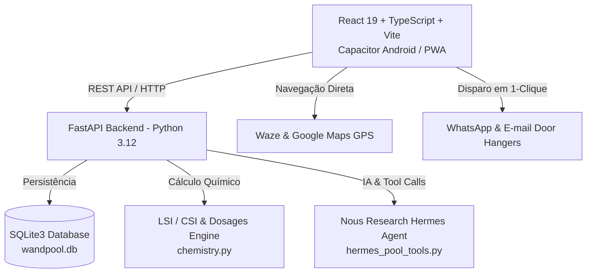
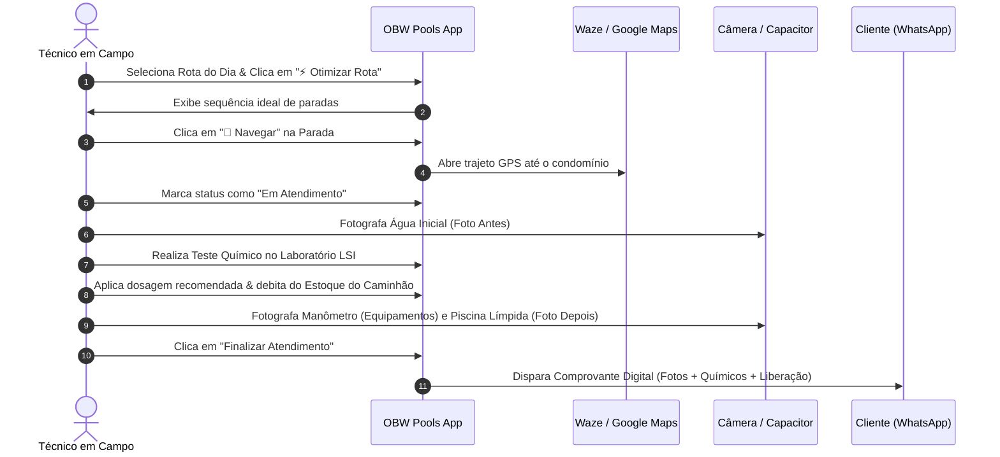

# 📐 OBW Pools - Manual de Arquitetura & Engenharia de Software

Este documento detalha as decisões de engenharia, modelos de dados, fluxo de eventos em campo e integração com IA no ecossistema **OBW Pools**.

---

## 🏛️ 1. Visão Arquitetural

---

## 🗄️ 2. Modelo de Dados Relacional (SQLite)

### Tabela `pools` (Piscinas e Clientes)
| Campo | Tipo | Descrição |
| :--- | :--- | :--- |
| `id` | TEXT (PK) | Identificador único (`pool-1`, `pool-2`, etc.) |
| `name` | TEXT | Nome descritivo da piscina |
| `customer_name`| TEXT | Nome do proprietário ou condomínio |
| `customer_phone`| TEXT | Telefone para disparo de WhatsApp |
| `customer_email`| TEXT | E-mail para envio de comprovantes digitais |
| `address` | TEXT | Endereço com cidade (DFW Metroplex) |
| `latitude` | REAL | Latitude para geolocalização e cálculo TSP |
| `longitude`| REAL | Longitude para geolocalização |
| `gate_code`| TEXT | Código de portão / instruções de acesso |
| `pool_type`| TEXT | `Residencial` ou `Comercial / Condomínio` |
| `surface_type` | TEXT | `Alvenaria`, `Fibra`, `Vinil`, `Pastilha` |
| `sanitizer_type`| TEXT | `Cloro Tradicional`, `Sal (SWG)`, etc. |
| `volume_liters` | INTEGER | Volume cúbico em litros |
| `volume_gallons`| INTEGER | Volume em galões americanos |
| `clean_filter_psi` | REAL | Pressão de referência com filtro limpo |
| `current_filter_psi` | REAL | Pressão atual medida |

### Tabela `routes` e `route_stops` (Logística em Campo)
- **`routes`**: Agrupa as paradas do dia (`id`, `technician_name`, `date`, `day_of_week`, `total_stops`, `completed_stops`).
- **`route_stops`**: Paradas com ordem de visitação sequencial (`order_index`), horário previsto (`scheduled_time`), status (`Pendente`, `A Caminho`, `Em Atendimento`, `Concluído`) e registro fotográfico (`photos_json`).

---

## 🧠 3. Algoritmos e Motores

### A. Otimização de Rota (Nearest-Neighbor TSP + Haversine)
1. Inicia nas coordenadas da sede da empresa (`start_lat`, `start_lng`).
2. Itera recursivamente sobre as paradas não visitadas calculando a distância pelo arco esférico da Terra ($R = 6371\text{ km}$):
   $$a = \sin^2\left(\frac{\Delta \text{lat}}{2}\right) + \cos(\text{lat}_1)\cos(\text{lat}_2)\sin^2\left(\frac{\Delta \text{lng}}{2}\right)$$
   $$d = 2R \cdot \text{atan2}\left(\sqrt{a}, \sqrt{1-a}\right)$$
3. Reatribui os `order_index` e recalcula os horários programados com base em uma janela estimada de atendimento de 55 minutos por piscina.

### B. Equilíbrio Químico LSI (Langelier Saturation Index)
Determina o potencial de agressividade ou incrustação da água:
$$LSI = \text{pH} + TF + CF + AF - 12.1$$
- $TF = \frac{\log_{10}(T_F) - 1}{10}$ (Fator Temperatura)
- $CF = \log_{10}(\text{CH}) - 0.4$ (Fator Cálcio)
- $AF = \log_{10}(\text{TA} - (\text{CYA} \times 0.33)) - 0.4$ (Alcalinidade de Carbonato corrigida por CYA)

---

## 🛡️ 4. Fluxo Operacional Diário do Técnico

