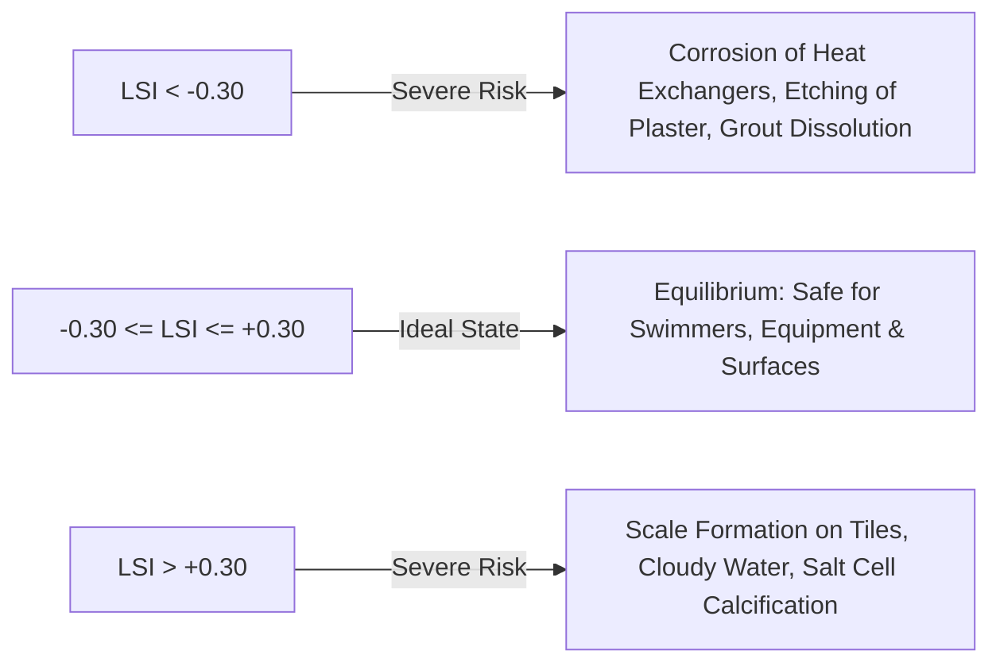

# 🧪 OBW Pools - Water Chemistry & LSI Mathematical Engine

This document outlines the mathematical equations, factor tables, and chemical dosing conversions used across the **OBW Pools** platform.

---

## 1. Langelier Saturation Index ($LSI$)

The Langelier Saturation Index ($LSI$) measures the degree of calcium carbonate ($\text{CaCO}_3$) saturation in pool water, predicting whether the water has a tendency to dissolve plaster and corrode equipment or precipitate scale.

$$LSI = \text{pH} + TF + CF + AF - TDS$$

---

### Temperature Factor ($TF$)
Where $T_F$ is the water temperature in degrees Fahrenheit ($^\circ\text{F}$):
$$TF = \frac{\log_{10}(T_F) - 1}{10}$$

| Temperature ($^\circ\text{F}$) | Temperature ($^\circ\text{C}$) | $TF$ Value |
| :---: | :---: | :---: |
| $32^\circ\text{F}$ | $0^\circ\text{C}$ | $0.0$ |
| $53^\circ\text{F}$ | $12^\circ\text{C}$ | $0.3$ |
| $76^\circ\text{F}$ | $24^\circ\text{C}$ | $0.7$ |
| $84^\circ\text{F}$ | $29^\circ\text{C}$ | $0.8$ |
| $104^\circ\text{F}$ | $40^\circ\text{C}$ | $0.9$ |

---

### Calcium Hardness Factor ($CF$)
Where $CH$ is Calcium Hardness in $\text{ppm}$ ($\text{mg/L}$):
$$CF = \log_{10}(CH) - 0.4$$

| Calcium Hardness (ppm) | $CF$ Value |
| :---: | :---: |
| $100\text{ ppm}$ | $1.6$ |
| $150\text{ ppm}$ | $1.8$ |
| $200\text{ ppm}$ | $1.9$ |
| $300\text{ ppm}$ | $2.1$ |
| $400\text{ ppm}$ | $2.2$ |
| $800\text{ ppm}$ | $2.5$ |

---

### Alkalinity Factor ($AF$) & Cyanurate Correction
Cyanuric Acid ($CYA$) contributes to Total Alkalinity ($TA$). To determine true **Carbonate Alkalinity ($CA$)**, we apply the cyanurate correction:
$$CA = TA - (CYA \times 0.33)$$
$$AF = \log_{10}(CA) - 0.4$$

| Carbonate Alkalinity (ppm) | $AF$ Value |
| :---: | :---: |
| $50\text{ ppm}$ | $1.3$ |
| $80\text{ ppm}$ | $1.5$ |
| $100\text{ ppm}$ | $1.6$ |
| $120\text{ ppm}$ | $1.7$ |
| $150\text{ ppm}$ | $1.8$ |

---

### Total Dissolved Solids Factor ($TDS$)
- For traditional chlorine pools ($TDS < 1500\text{ ppm}$): $TDS = 12.1$
- For saltwater generator pools ($TDS \approx 3000 - 5000\text{ ppm}$): $TDS = 12.2\text{ to }12.4$

---

## 2. LSI Risk Evaluation Matrix

---

## 3. Chemical Dosing Engine Formulas

All dosages are scaled to $10,000\text{ gallons}$ ($\approx 37,850\text{ liters}$):

$$\text{Scale Factor} = \frac{\text{Pool Volume in Gallons}}{10,000}$$

### 1. pH Reduction (Muriatic Acid 31.45% / 20° Baumé)
$$\text{Acid (fl oz)} = \left(\frac{|\Delta\text{pH}|}{0.1}\right) \times 5.0\text{ fl oz} \times \text{Scale Factor}$$

### 2. pH Elevation (Soda Ash / Sodium Carbonate)
$$\text{Soda Ash (oz)} = \left(\frac{\Delta\text{pH}}{0.1}\right) \times 3.0\text{ oz} \times \text{Scale Factor}$$

### 3. Total Alkalinity Elevation (Sodium Bicarbonate)
$$\text{Bicarbonate (lbs)} = \left(\frac{\Delta\text{TA}}{10\text{ ppm}}\right) \times 1.5\text{ lbs} \times \text{Scale Factor}$$

### 4. Free Chlorine Disinfection (Liquid Chlorine 12.5% vs Dichlor 56%)
- **Liquid Chlorine**: $\Delta\text{FC} \times 10.7\text{ fl oz} \times \text{Scale Factor}$
- **Dichlor Granular**: $\Delta\text{FC} \times 2.4\text{ oz} \times \text{Scale Factor}$
- **Cal-Hypo 65%**: $\Delta\text{FC} \times 2.0\text{ oz} \times \text{Scale Factor}$

### 5. Calcium Hardness (Calcium Chloride 100%)
$$\text{Calcium Chloride (lbs)} = \left(\frac{\Delta\text{CH}}{10\text{ ppm}}\right) \times 1.25\text{ lbs} \times \text{Scale Factor}$$

### 6. Stabilizer (Cyanuric Acid 100%)
$$\text{CYA (lbs)} = \left(\frac{\Delta\text{CYA}}{10\text{ ppm}}\right) \times 0.81\text{ lbs} \times \text{Scale Factor}$$

### 7. Salt Elevation (Sodium Chloride for SWG)
$$\text{Salt (lbs)} = \left(\frac{\Delta\text{Salt}}{100\text{ ppm}}\right) \times 8.3\text{ lbs} \times \text{Scale Factor}$$
